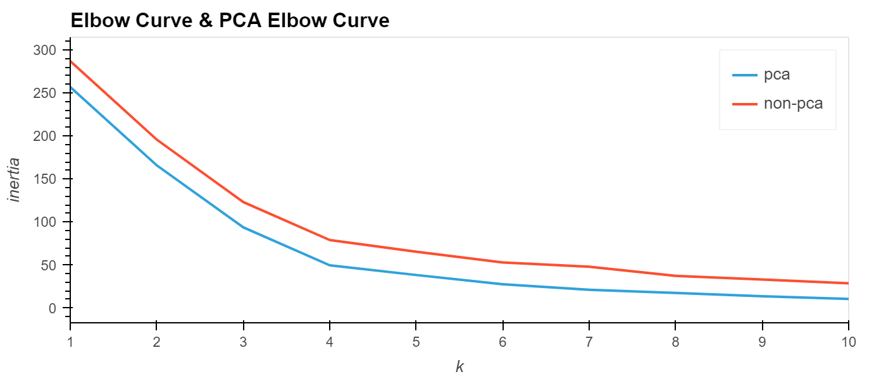

# ***Analyzing Cryptocurrency - Kmean Clusters***
---

## *Necessary Library Installs*
- import pandas as pd
- import hvplot.pandas
- from path import Path
- from sklearn.cluster import KMeans
- from sklearn.decomposition import PCA
- from sklearn.preprocessing import StandardScaler
- import warnings
    - warnings.filterwarnings('ignore')
   
## *Analysis*

To begin analyzing the data and clustering it using the KMeans method, we first need read the data from a csv file into a DataFrame and scale the data. The data we are using is for 41 various coins and each of theirs price change percentage varying from 24hr to 1 yr. 

To scale the data with use the StandardScaler and the following code 
```python
 # Use the `StandardScaler()` module from scikit-learn to normalize the data from the CSV file
scaled_data = StandardScaler().fit_transform(df_market_data)
```

With this, we create a DataFrame of the scaled data and set the index to 'coin_id' 
```python
# Copy the crypto names from the original data
df_market_data_scaled["coin_id"] = df_market_data.index

# Set the coinid column as index
df_market_data_scaled = df_market_data_scaled.set_index("coin_id")
```
Since the data is now scaled, we can now use it to find the best k value for creating the data clusters. To find the best k value we will use the Elbow curve method. Based on this data's Elbow Curve below, we can choose the best option for k will be 4:


Now we have our k value therefore we can produce the clusters of data using the KMeans method. To create the clusters, we first need to create a model, fit the model to the data and then use the model to predict the clusters. The predicted clusters are presented in an array format, therefore they need to be added to a copy of the scaled data DataFrame created previously. 

The graph for the Kmeans clusters looks as follows:


Other than using the scaled data, the best value of k can also be found using a principal component analysis (PCA).  To use PCA, we first need to choose the number of n_components (in our case we set it to 3) and than fit it to our data:
```python
# Create a PCA model instance and set `n_components=3`.
pca = PCA(n_components=3)
# Use the PCA model with `fit_transform` to reduce to 
# three principal components.
market_data_pca = pca.fit_transform(df_market_data_scaled)
```
Because the data provided is in an array, we need to change into a DataFrame and create an index using the 'coin_id' column from the original data. With the created PCA dataframe we can repeat the steps of finding the k value using the elbow method and then running the resulting k value in the KMeans model. 

Below presents the comparison between the elbow curve found using the PCA and just the scaled data.



With this graph we can determine that the k value found using the PCA method allows us to find the closest k value with the least amount of outliers.
